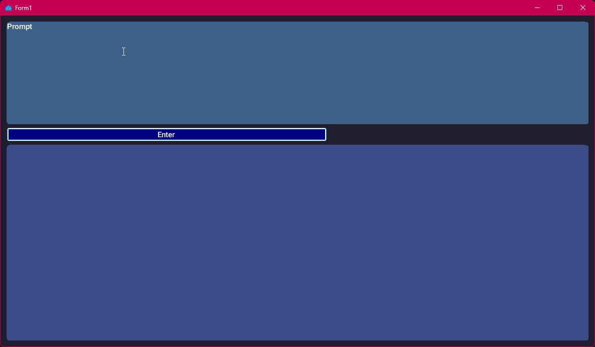

# 📦 OllamaChatUI

A simple graphical interface for chatting with language models (like Gemma 1B) via the local [Ollama](https://ollama.com/) API. Built with Windows Forms in C#, featuring Persian (Farsi) language support, custom fonts, and beautifully designed input/output boxes with rounded corners.

---

## 🖼️ Sample Screenshot



---

## ✨ Features

- Chat with LLMs via Ollama API
- Simple and minimalistic UI
- Full Persian (RTL) language support
- Custom font (Vazirmatn)
- Rounded corners for text boxes
- Font loaded from memory (no system installation required)

---

## 📦 Dependencies

- .NET Framework 4.7.2 or later
- [Newtonsoft.Json](https://www.nuget.org/packages/Newtonsoft.Json)
- Local [Ollama](https://ollama.com/) service running (`http://localhost:11434`)

---

## 🛠️ Setup & Run

1. **Install and run Ollama**

   ```bash
   ollama run gemma3:1b (For Example)
   ```

2. **Run the application**


---

## 🔐 Security Tips
Communication with the API is done locally and does not require authentication.
